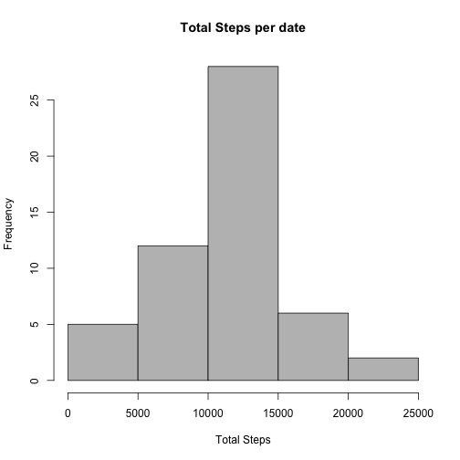
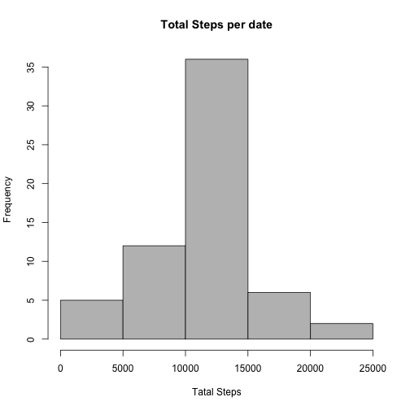

## Loading and preprocessing the data
### Loading data to "data" and "data1"" is the data after excluded NA values from "data"    


```r
data <- read.csv(unz("activity.zip", "activity.csv"), header=T, sep=",")
data$date <- as.Date(data$date)
data1 <- data[!rowSums(is.na(data[c("steps","date","interval")])), ]
```

## What is mean total number of steps taken per day?
### 1, Make a histogram of the total number of steps taken each day


```r
sumsteps <- aggregate(data1$steps,by=list(data1$date),FUN=sum)
colnames(sumsteps) <- c("date","steps")

hist(sumsteps$steps,col="grey", xlab="Tatal Steps",
     main="Total Steps per date")
```

 

### 2, Calculate and report the mean and median total number of steps taken per day.

```r
meansteps <- mean(sumsteps$steps)
mediansteps <- median(sumsteps$steps)
```
The mean value and median total number of steps taken per day are 10766.19 and 10765.

## What is the average daily activity pattern?
### 1. Make a time series plot of the 5-minute interval (x-axis) and the average number of steps taken, averaged across all days (y-axis).


```r
meanstpes <- aggregate(data1$steps,by=list(data1$interval),FUN=mean)
colnames(meanstpes) <- c("interval","meansteps")
plot(meanstpes$interval,meanstpes$meansteps,type="l",ylab="Average steps", xlab="Time interval")
```

 
### 2. Which 5-minute interval, on average across all the days in the dataset, contains the maximum number of steps?

```r
subset(meanstpes, meanstpes$meansteps == max(meanstpes$meansteps))
```

```
##     interval meansteps
## 104      835  206.1698
```
###On average across all the days in the dataset, 5-minute interval 835, contains the maximum number of steps.

## Imputing missing values
### 1.Calculate and report the total number of missing values in the dataset.

```r
sum(rowSums(is.na(data[c("steps","date","interval")])))
```

```
## [1] 2304
```
### In this dataset, 2304 rows have missing value. 

### 2. Devise a strategy for filling in all of the missing values in the dataset. The strategy does not need to be sophisticated.

### The average steps per date is much more steady than those per time interval. Thus, for missing values, I use mean step value for day instead of mean step value for time interval. 

### 3. Create a new dataset that is equal to the original dataset but with the missing data filled in.

```r
meanstpes2 <- aggregate(data1$steps,by=list(data1$date),FUN=mean)
colnames(meanstpes2) <- c("date","steps")
datafilled <- data
nasteps <- is.na(data[1])
for (i in 1:nrow(data)) {
        if(nasteps[i]) {
                datafilled[i,1] <- mean(meanstpes2$steps) 
        }
}
```

### Now, the "datafilled" have the same structure with original "data", but with the missing value filled in. 
###4. Make a histogram of the total number of steps taken each day and Calculate and report the mean and median total number of steps taken per day. Do these values differ from the estimates from the first part of the assignment? What is the impact of imputing missing data on the estimates of the total daily number of steps?

```r
sumsteps1 <- aggregate(datafilled$steps,by=list(datafilled$date),FUN=sum)
colnames(sumsteps1) <- c("date","steps")

hist(sumsteps1$steps,col="grey", xlab="Tatal Steps",
     main="Total Steps per date")
```

 


```r
meansteps1 <- mean(sumsteps1$steps)
mediansteps1 <- median(sumsteps1$steps)
```
### The mean and median step value per date are 10766.19 and 10766.19. Compared to the results above, the mean value does not chaned, because I replaced missing values by mean step value per date. Median value changed slightly, because I gave values for missing values, thus, the number of samples to calculate median is changed. 

## Are there differences in activity patterns between weekdays and weekends?
###1.Create a new factor variable in the dataset with two levels – “weekday” and “weekend” indicating whether a given date is a weekday or weekend day.

```r
datafilled$date <- as.Date(datafilled$date)
datafilled$date1 <- weekdays(datafilled$date)
datafilled$date2 <- weekdays(datafilled$date)
for(i in 1:nrow(datafilled)) {
        if (datafilled[i,4] == "Sunday" | datafilled[i,4] == "Saturday") {
                datafilled[i,"date2"] <- "weekend"    
        }
        else {
                datafilled[i,"date2"] <- "weekday" 
        }
}
head(datafilled, 3)
```

```
##     steps       date interval  date1   date2
## 1 37.3826 2012-10-01        0 Monday weekday
## 2 37.3826 2012-10-01        5 Monday weekday
## 3 37.3826 2012-10-01       10 Monday weekday
```
### Now in the colomn "date2", we have "weekday" and "weekend".
### 2.Make a panel plot containing a time series plot of the 5-minute interval (x-axis) and the average number of steps taken, averaged across all weekday days or weekend days (y-axis). 

```r
subdataweekday <- subset(datafilled, datafilled$date2 == "weekday")
subdataweekend <- subset(datafilled, datafilled$date2 == "weekend")

meanstpesweekday <- aggregate(subdataweekday$steps,by=list(subdataweekday$interval),FUN=mean)
colnames(meanstpesweekday) <- c("interval","meansteps")

meanstpesweekend <- aggregate(subdataweekend$steps,by=list(subdataweekend$interval),FUN=mean)
colnames(meanstpesweekend) <- c("interval","meansteps")
```


```r
par(mfcol = c(2,1),mar=c(4,4,2,2))
plot(meanstpesweekday$interval,meanstpesweekday$meansteps,type="l",ylab="Numbers of steps", xlab="Time interval",main="weekday")
plot(meanstpesweekend$interval,meanstpesweekend$meansteps,type="l",ylab=" Number of steps", xlab="Time interval",main="weekend")
```

 
list.files()
